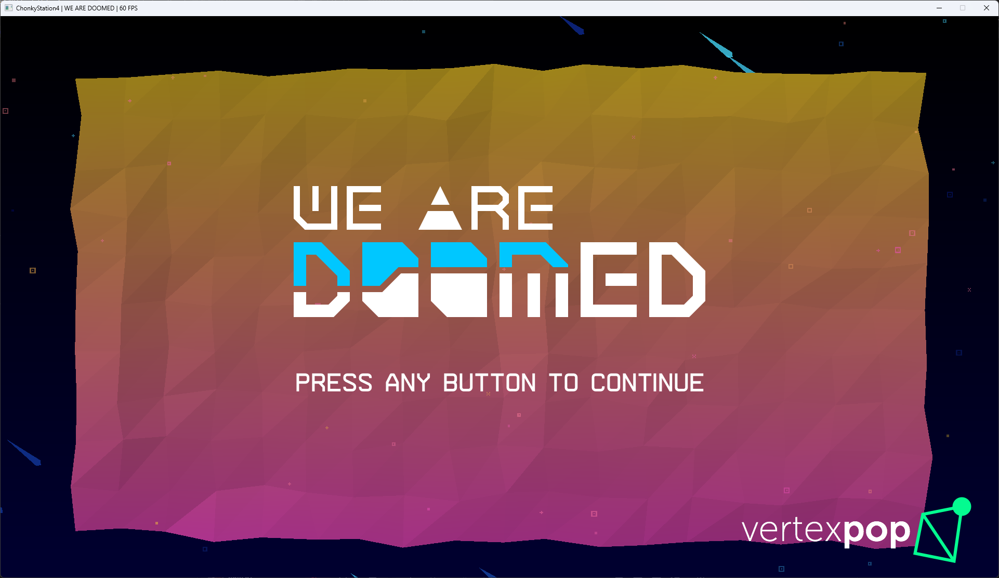
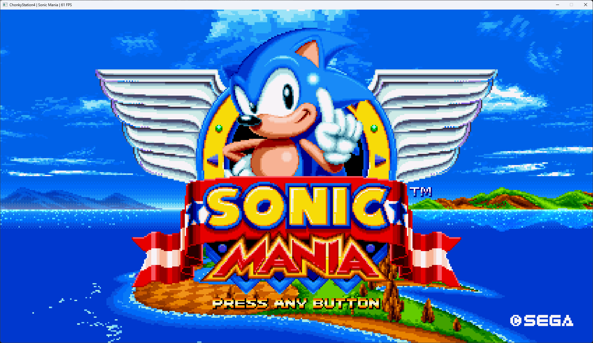

<h1>
  

    <strong>A PlayStation© 4 emulator</strong>
  

</h1>

---

ChonkyStation4 is a work-in-progress emulator for the PlayStation 4 system. 
It can currently boot a few simple commercial games. 
This is a hobby project I'm developing for fun and to learn. 
<b>You should not use this to actually play games.</b> At least not for now. 

---
 

    <a href="https://discord.gg/YU2yjP5jvS"></img></a>

---
 

    <h1>Showcase</h1>
    
    

