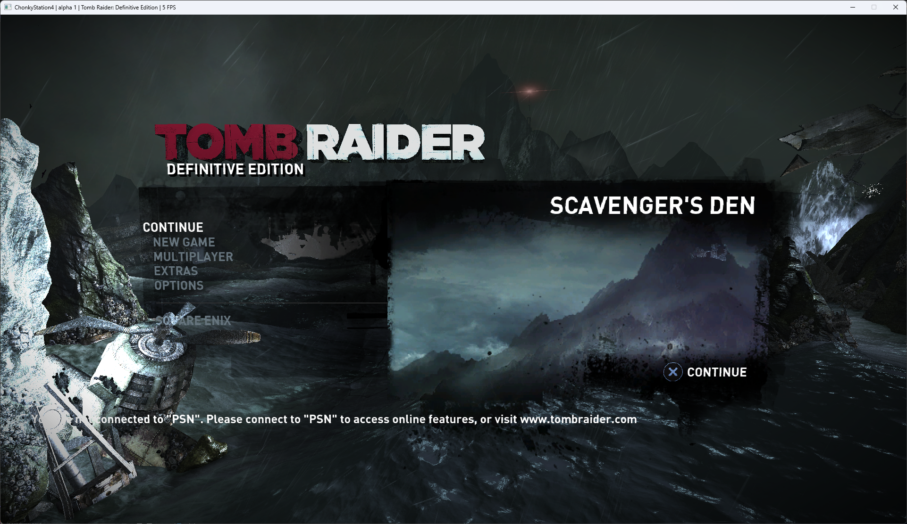

<h1>
  

    <strong>A PlayStation© 4 emulator</strong>
  

</h1>

---

ChonkyStation4 is a work-in-progress emulator for the PlayStation 4 system. 
It can currently boot a few simple commercial games. 
This is a hobby project I'm developing for fun and to learn. 

---
 

    <a href="https://discord.gg/YU2yjP5jvS"></img></a>

---
 

    <h1>Usage</h1>
    To use the emulator, you must first place your decrypted firmware modules in <strong>%appdata%/ChonkyStation/ChonkyStation4/sysmodules</strong>. 
    Next, simply run the game as follows: <code>ChonkyStation4.exe [path-to-game-folder]</code>.

---
 

    <h1>Compatibility</h1>
    
A compatibility list is available <a href=https://github.com/ChonkyStation/ChonkyStation4-Compatibility>here</a>.

---
 

    <h1>Showcase</h1>
    
    

